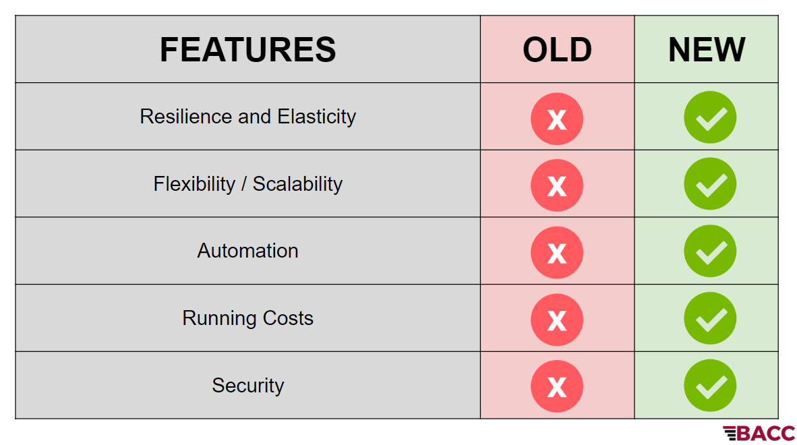
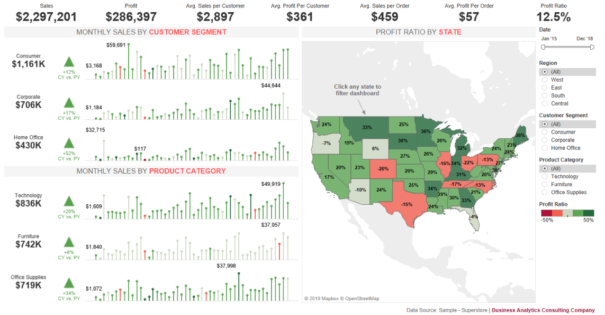
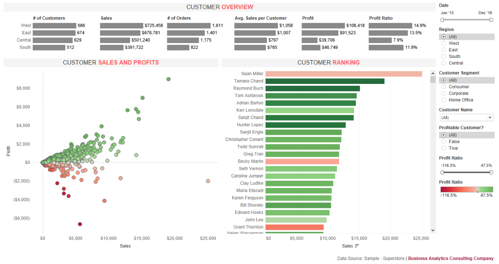

# Superstore

                                                       By
						
		 Christian Bourdeau, Amairani Garcia, Shan Huang, Anaisa Cerda, and Priyanka Grover

## Project Overview:
Business Analytics Consulting Company (BACC) helps businesses unleash the power of their data by developing data pipelines, predictive 
analytics, and automating dashboards. 

On the below website we share our client's success story of the retail chain Superstore.
http://bacc.ga

Using the below link you may directed straight to the tableau dashboards used for the analysis.
https://public.tableau.com/profile/cbourdeau#!/vizhome/BACC-Superstore/ExecutiveOverview

## Technology Used:
| Technology   		| Description    						|
| :---         		|     :---:      						|
|  Github      		| HTML, CSS, Bootstrap						|
|  AWS      		| Amazon Web Services (RDS, S3, AWS platform) was used as Cloud Storage, Interface between the Database and Website, as well as to Deploy the Website 			|
|  Zepl, PySpark   	            | Cloud Computing    		                                                            |
|  Python 	                        | Machine Learning (Sklearn, TensorFlow, Pandas)	                                    |
|  Tableau	                        | Data Visualization		                                                            |

## Background:
Since 2012, Superstore has collected data on sales, customers, products, etc. Although the data is regularly collected in their Enterprise Resource Planning (ERP) and Customer Relationship Management (CRM) systems, the reporting team has yet to implement a dashboard or sophisticated reporting process. Their process consisted of manually pulling data from the ERP and CRM and manipulating it in Excel. Initially, this workflow worked, but as their company grew, the data grew along with it and Excel started to slow down. As a result, reports started having longer turnarounds, the reporting team became overworked, and executives got restless. 
One day, the data reached the maximum number of rows workable in Excel and reporting was brought to a screeching halt. The executives lost visibility into their business, management could not measure their KPIs, and analysts could not develop reports. The CEO and other high-level executives had a number of questions on the performance of their company but could not get their team to provide thorough insights, so they decided to get help from BACC to fix its data pipeline, automate standard reports, and ask deeper questions.
            
## Business Questions:
1. How do we fix our data process so that Superstore can get reports faster?

2. How are sales performing year-over-year?

3. Which products are performing well? Which are not?

4. Who are our most profitable customers?

5. How efficient is the warehouse team at shipping products on time?

6. What does our sales projection look like for next year?

                                          "When it comes to data, we got your BACC"

       
